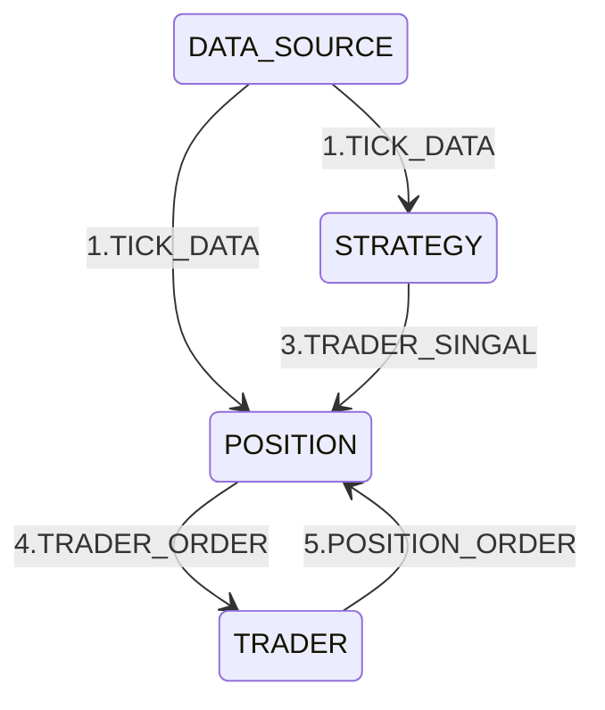

### 快速入门

### 文件目录说明

# Django 项目目录说明文档

## 介绍
### 快速开始
1.环境准备 python3.13
```bash
# centos 源码安装示例

# 安装前置依赖
yum -y install zlib-devel bzip2-devel libffi-devel openssl-devel ncurses-devel readline-devel tk-devel gcc make sqlite sqlite-devel sqlite-libs


# 2.下载python源码
wget https://www.python.org/ftp/python/3.13.0/Python-3.13.0.tgz
tar -zxvf Python-3.13.0.tgz
cd Python-3.13.0

# 4.安装python
./configure --enable-loadable-sqlite-extensions --enable-optimizations --with-lto
# 不需要sqlite去掉 --enable-loadable-sqlite-extensions
# 不需要性能优化去掉 --enable-optimizations --with-lto
# 资源不足可去掉 --with-lto
make -j 4 
make altinstall

# 5.确认结果
python[3.13] --version
```

2.安装依赖 初始化数据库
``` bash
python[3.13] update.py
```
3.运行
```bash
python[3.13] main.py
```
或
```bash
# 进入web目录 启动django程序
python[3.13] manage.py runserver 0.0.0.0:8000
```
4.访问
初始用户：admin
初始密码：123456

5.升级程序（第一次或者更新都建议执行下）
```bash
# 升级数据库结构 执行库表变更， 老数据不会丢
python[3.13] update.py
```

## 主要事件流

## 目录结构

```plaintext
.
├── /leek                        # 根目录
│   ├── /leek                    # 策略主目录
│   │   ├── /common              # 通用工具库
│   │   ├── /data                # 数据源
│   │   │   └── data.py          # 数据源定义
│   │   ├── /runner              # 执行器目录
│   │   │   └── runner.py        # 执行器，管理数据源 策略 交易器生命周期
│   │   ├── /trade               # 交易指令执行器
│   │   │   └── trade.py         # 交易执行器定义
│   │   ├── /script              # 脚本
│   │   ├── /tests               # 单元测试
│   ├── /docs                    # 文档
│   │   ├── /img                 # 图片
│   ├── /resources               # 资源目录
│   │   ├── /data                # 图片
│   │   ├── /db.yaml             # 项目数据库配置
│   │   ├── /db-default.yaml     # 项目数据库配置
│   ├── /web                     # web页面
│   │   ├── /static              # 静态资源
│   │   │   ├── js               # js文件
│   │   ├── /templates           # 模版目录
│   │   │   ├── workstation      # 工作台(app)模板
│   │   ├── /websit              # django-admin 目录
│   │   ├── /workstation         # 后台目录
│   │   │   ├── /migrations      # 存放数据库迁移文件
│   │   │   ├── /templatetags    # 自定义标签目录
│   │   │   ├── __init__.py      # 初始化文件
│   │   │   ├── admin.py         # 管理员配置文件
│   │   │   ├── apps.py          # 应用程序配置
│   │   │   ├── models.py        # 数据模型定义
│   │   │   ├── tests.py         # 测试文件
│   │   │   ├── script.py        # 脚本
│   │   │   ├── urls.py          # 路径映射
│   │   │   ├── views.py         # 视图函数
│   │   │   └── worker.py        # web 策略执行器
│   │   ├── manage.py            # Django 项目管理命令
│   ├── requirements.txt         # 项目依赖的Python包列表
│   ├── main.py                  # 启动入口
│   ├── READE.md
```

