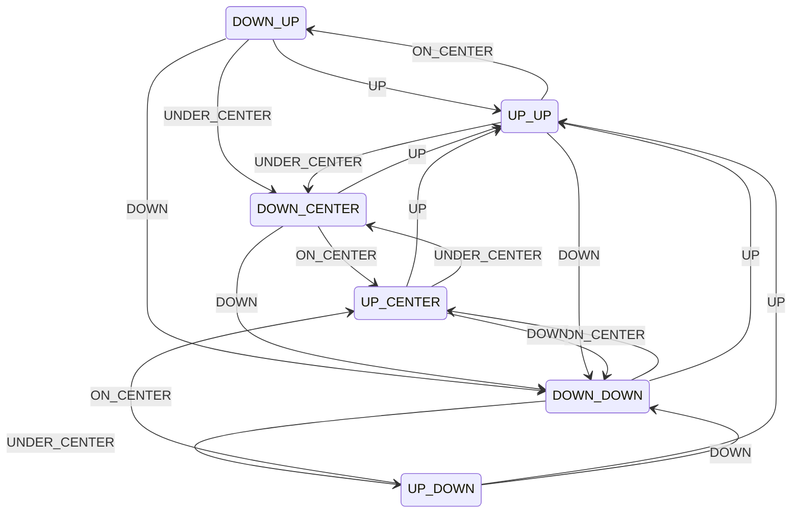

### 状态转换
#### 状态列表说明
| 状态          | 状态说明 |
|-------------|------|
| DOWN_DOWN   | 下穿下轨 |
| DOWN_CENTER | 下穿中轨 |
| DOWN_UP     | 下穿上轨 |
| UP_UP       | 上穿上轨 |
| UP_CENTER   | 上穿中轨 |
| UP_DOWN     | 上穿下轨 |
#### 事件列表说明
| 事件           | 事件说明    |
|--------------|---------|
| UP           | 上轨外     |
| ON_CENTER    | 中轨到上轨之间 |
| UNDER_CENTER | 中轨到下轨之间 |
| DOWN         | 下轨外     |
